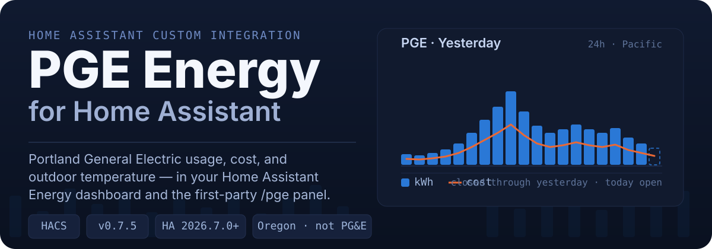
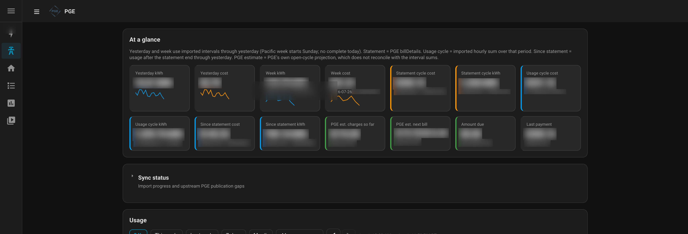
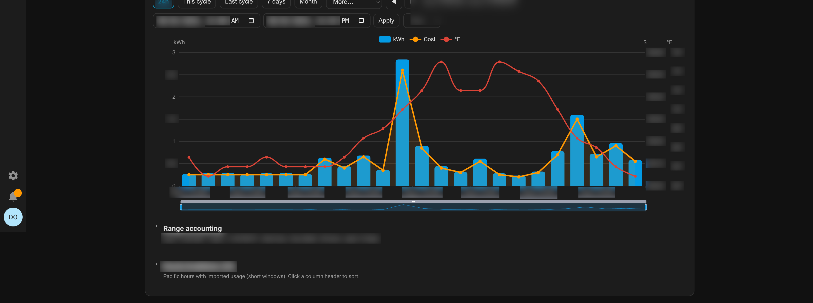
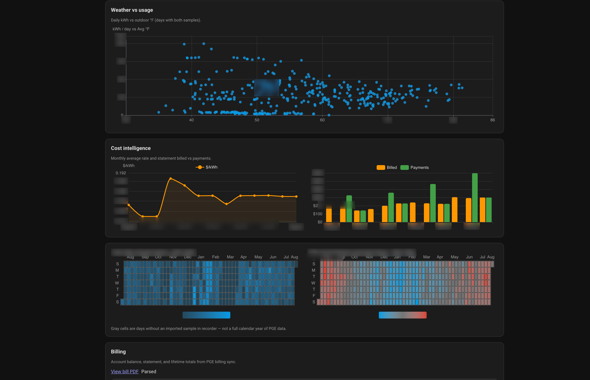
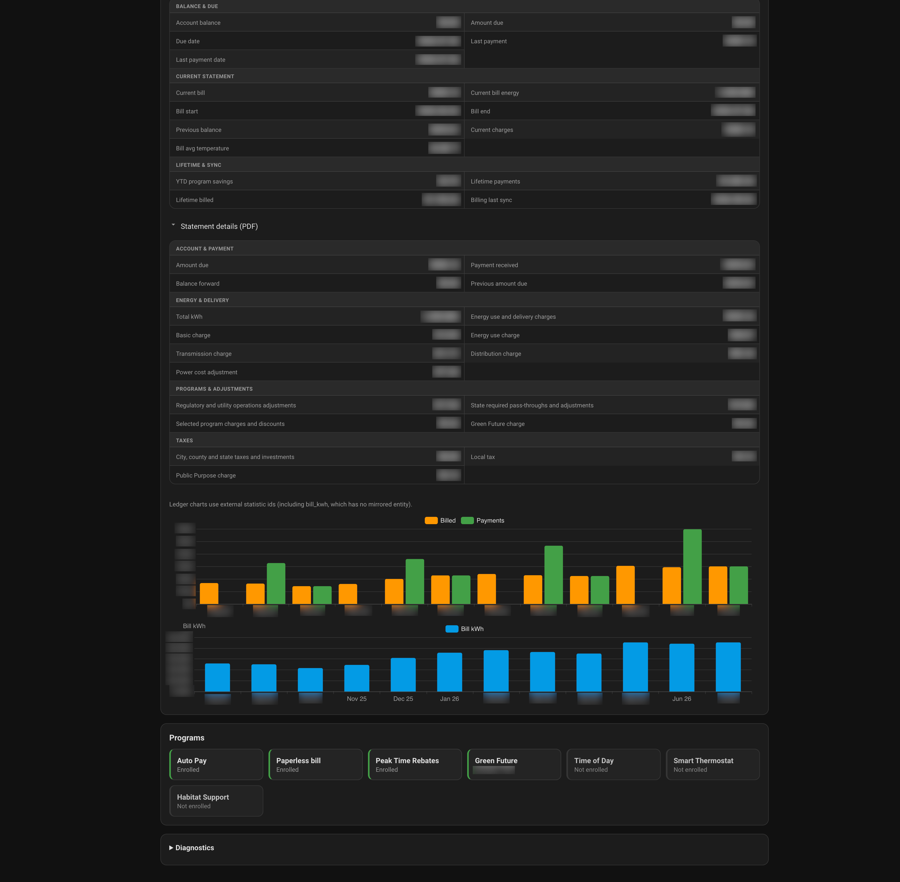
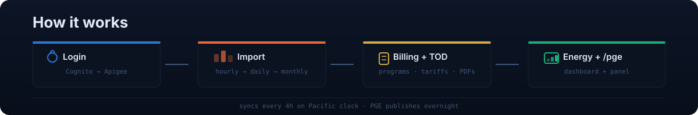

# Portland General Electric (PGE) Energy for Home Assistant



Home Assistant custom integration for **Portland General Electric (PGE)** — imports your energy usage into the HA Energy dashboard and a first-party `/pge` panel, using PGE's own in-house portal GraphQL API (not Opower, not HTML scraping).

> **Not Pacific Gas & Electric (PG&E).** This is for [Portland General Electric](https://portlandgeneral.com/) in Oregon. It does **not** work with California PG&E / Opower integrations.
>
> **Unsupported / unofficial:** MFA- and CAPTCHA-enabled PGE accounts are not supported (fail closed). The portal API is unofficial and may change without notice. Not affiliated with or endorsed by Portland General Electric.

**Requires Home Assistant 2026.7.0+.**

---

## The panel

A first-party Home Assistant panel at `/pge` — usage, cost, outdoor temperature, billing, programs, and live sync progress for all configured accounts.


_At a glance — yesterday and week totals, statement and since-statement sums, PGE's own open-cycle estimates, amount due._


_Usage — hourly kWh bars with a cost series, plus Range accounting and per-hour breakdown tables._

<p align="center">
  
  
  <br><em>Analytics — weather vs usage and cost intelligence · Billing — balance, statements, bill PDFs, programs.</em>
</p>

---

## What it does

- **Hourly → daily → monthly usage history** (kWh, cost, outdoor temperature) imported into HA Energy statistics, with tiered backfill of your full account history.
- **Dual-published data**: every series is both a `sensor.pge_*` entity and a `pge_energy:*` statistic, so it works in the Energy dashboard, History, and the entity Statistics graph.
- **Billing & programs** sensors — balance, amount due, statements, lifetime totals, autopay/paperless/PTR/Green Future/Time-of-Day enrollment, and PGE's open-cycle estimates.
- **Unattended login** — PGE email/password (Cognito → Apigee), stored locally with automatic token renewal; rate limits soft-fail instead of locking your account.
- **Resilient by default** — auth or sync failures keep your last-known sensors and recorder history; long backfills self-heal on stall; sync status always reaches a terminal state.

## How it works



A single `PGECoordinator` authenticates once per entry, then polls PGE's GraphQL endpoint on a Pacific sync clock (default **every 4 hours** from **12:00 AM** — 12am/4am/8am/noon/4pm/8pm). Closed intervals are imported as statistics; the `/pge` panel reads those same recorder statistics for its charts. Auth chain and data model details live in [`docs/ARCHITECTURE.md`](docs/ARCHITECTURE.md) and [`docs/DATA_CONTRACT.md`](docs/DATA_CONTRACT.md).

PGE publishes usage **once overnight**, so a "stuck" latest interval near `01:00` Pacific during the day is expected — not a sync failure.

---

## Installation

### HACS (recommended)

1. HACS → **⋯** → **Custom repositories**, add `https://github.com/spencerthayer/homeassistant-pge` with category **Integration**.
2. Install **Portland General Electric Energy Usage** (version matches the latest GitHub Release, e.g. `0.9.11`).
3. Restart Home Assistant.

### Manual

1. Copy `custom_components/pge_energy` into `config/custom_components/`.
2. Restart Home Assistant.

## Setup

1. Settings → Devices & Services → **Add Integration** → _Portland General Electric Energy Usage_.
2. Enter PGE **email**, **password**, and **account number** (one entry per account).
3. The same login can own multiple entries with different account numbers; each login's password is stored in that entry.
4. **MFA-enabled PGE accounts are not supported** — if PGE requires MFA or CAPTCHA, setup fails closed.

Setup validates connectivity with an hourly request for yesterday, then the first sync backfills history.

---

## Usage

### Energy Dashboard

The Energy dashboard needs a **statistic** (or a lifetime cumulative sensor). Tip/day sensors are the wrong pick.

1. Settings → Dashboards → Energy → **Add consumption**.
2. Prefer the external statistic `pge_energy:<account_key>_consumption` for **Grid consumption**.
   - Open More info on `sensor.pge_<account_number>_energy` and copy the `external_statistic_id` attribute.
   - The middle segment is an opaque `account_key` hash — searching by PGE account number will not find it ([#10](https://github.com/spencerthayer/homeassistant-pge/issues/10)).
3. Simpler alternative: pick `sensor.pge_<account_number>_energy` (friendly name **Consumption**, lifetime imported kWh, `total_increasing`). Prefer the external id when possible — backfill and repairs write that series directly. The Energy statistic picker labels the series `PGE <account> consumption` so it is distinct from `… return`.
4. Solar / net-metered accounts (v0.8.0+): also add `pge_energy:<account_key>_return` (or `sensor.pge_<account_number>_return`) for **Return to grid**, plus `_cost` / `_compensation` if wanted.

Do **not** use for Grid consumption:

- `sensor.pge_*_hourly_energy` — latest closed hour tip only
- `sensor.pge_*_current_day_energy` — Pacific day total that resets

If the dashboard shows a huge negative kWh spike after a history rebuild, use the external `_consumption` / `_return` series (v0.8.0+ splits signed HOURLY import/export) and clear any stale orphaned `pge_energy:*` ids under Developer Tools → Statistics.

### PGE panel `/pge`

The integration registers `/pge` and (for admin users, by default) a sidebar item **PGE**. Use it for usage, cost, temperature, billing, programs, and live sync progress:

- **At a glance** — yesterday and week (Pacific Sunday → yesterday) kWh/cost, statement and since-statement sums, PGE estimate cards, amount due. Click any KPI tile to copy its label, value, and note to the clipboard. A collapsible **Sync status** section shows live import progress and PGE publication gaps.
- **Usage** — combined multi-series chart. For generating accounts, **grid flow** bars go above zero for import and below zero for export (Opower/HA Energy style); the money line is **import cost**, or **net interval amount** (`cost − compensation`) when export credits are present in the range — an interval estimate, not PGE’s statement credit bank. Ranges end at Pacific midnight of the current day. Fast-select: **24h / This cycle / Last cycle / 7 days / Month**, with **More…** for `6h`/`12h`/`3mo`/`6mo`/`12mo`/YTD. **Range accounting** uses the same signed projection.
- **Analytics** — weather vs usage (daily kWh vs outdoor °F) and cost intelligence (monthly average rate, billed vs payments).
- **Billing** — balance, statements, lifetime totals, and programs; when bill PDFs are enabled, **View bill PDF** + **Statement details (PDF)**.
- **Time of Day** — current E-TOU period/rate KPIs with a next-transition countdown, an enrollment badge, and the week schedule grid (Sun–Sat × 24h Pacific) highlighting the current hour. Usage is bucketed by period (energy, imported cost, TOD-priced, share, avg billed ¢/kWh). The local comparison **hero** is TOD-priced kWh vs **billed imported energy** for a window chosen **in the Time of Day section** (24h / This cycle / Last cycle / 7 days / Month / More… / custom; default Last cycle; independent of the Usage chart range). A collapsed **How this was calculated** table also shows the offline/portal **rate-card** TOD vs Basic model (kWh × published/default ¢ — not billed). Official PGE `getRateCompare` savings stay a separate card when the portal returns them. Holiday/off-peak days for the current year are listed in a collapsed note.
- Configure → **Panel** customizes the sidebar link (show/hide, title, icon), the admin gate, and the default landing section (including **Time of Day**). Hiding the link does **not** unregister `/pge` — it stays reachable by URL.

### Billing & programs

When **Import billing & programs** is on (default), the same device (`PGE <accountnum>`) gains balance, amount due, due date, last payment, current bill amount/kWh/period, previous balance/current charges, bill-period average temperature, YTD program savings, lifetime payments/billed, estimated current charges and next-bill (low/high) from PGE's own open-cycle projection, billing-cycle day/length, and binary sensors for Auto Pay, Paperless, Peak Time Rebates, Green Future, Time of Day, Smart Thermostat, and Habitat Support.

The estimate sensors are PGE's projection (`getEnergyTrackerData`) and will not tie out against sums of imported hourly intervals; they stay unavailable until PGE reports `detailsAvailable`.

### Bill PDFs (opt-in)

Enable **Download bill PDFs** in Configure → Sync settings (requires billing import; default **off**). After each billing sync the integration downloads eligible statement PDFs to `www/pge_energy/<account>/bills/`, parses them locally with `pypdf`, reconciles amount/kWh/period against GraphQL (**fail-closed** on mismatch), and imports 18 statement-dated `_bill_pdf_*` statistics. GraphQL billing sensors remain canonical; the PDF line-item sensors are disabled by default to reduce clutter.

> PDFs under `www/…` are reachable at `/local/…` **without** HA login if your instance is exposed — see [`SECURITY.md`](SECURITY.md).

### Services

All long-running services require `entry_id`:

| Service                              | Purpose                                                                  |
| ------------------------------------ | ------------------------------------------------------------------------ |
| `pge_energy.refresh`                 | Force a poll (optional `entry_id`)                                       |
| `pge_energy.backfill`                | Tiered hourly → daily → monthly backfill over `start_date`–`end_date`    |
| `pge_energy.retry_failed_ranges`     | Retry previously failed import ranges                                    |
| `pge_energy.reset_import_checkpoint` | Reset the backfill watermark (does not delete recorder history)          |
| `pge_energy.download_bill_pdf`       | Download a specific statement PDF (`bill_date`; optional `form`/`force`) |
| `pge_energy.reparse_bill_pdfs`       | Reparse retained PDFs only (no network)                                  |

---

## Configure

Settings → Devices & Services → PGE Energy → **Configure** (from any account entry):

- **Sync settings** — polling (value + minutes/hours/days unit, default **every 4 hours**), **Sync clock** (Pacific, default **12:00 AM**), correction window, history mode/start, hourly history days, auto backfill, cost/diagnostics, **Import billing & programs** (default on), **Download bill PDFs** (default off), **Time of Day rates** (optional overrides for the portal/`basic_service` rate card), concurrency, and the default-off diagnostic capture below.
- **Panel** — integration-wide chrome for `/pge`: show in sidebar (default on), sidebar title (default `PGE`), icon (default `mdi:transmission-tower`), admin-only (default on), default landing section. Sidebar _order_ stays with Home Assistant's sidebar editor / [Browser Mod](https://github.com/thomasloven/hass-browser_mod).
- **Update credentials** — email/password only; the account number is read-only and statistic IDs are unchanged.
- **Manual sync** — force **Refresh now** or **Backfill missing history** (uses your Sync settings). Stays available when the sidebar link is hidden.

Details: [`docs/HA_SETTINGS_HISTORY.md`](docs/HA_SETTINGS_HISTORY.md).

### Grid import/export diagnostic capture

Generating / net-metered accounts publish signed HOURLY usage: positive kWh is grid import, negative kWh is grid export ([#5](https://github.com/spencerthayer/homeassistant-pge/issues/5)). The integration splits those into non-negative `_consumption` / `_return` (and `_cost` / `_compensation`) statistics for the Energy dashboard and `/pge` panel. An off-by-default **Enable diagnostic capture** switch remains available for follow-up GraphQL captures (`PGE_ALPHA_GRID_CAPTURE`); it never logs credentials, tokens, or identifiers.

---

## Sensors & statistics

Every usage series is available in **both** forms:

| Use case                                    | Pick                                                              |
| ------------------------------------------- | ----------------------------------------------------------------- |
| Entity picker, History, most Lovelace cards | `sensor.pge_<account_number>_energy` / `_cost` / `_outdoor_temperature`  |
| Energy dashboard / statistics graphs        | `pge_energy:<account_key>_consumption` / `_return` / `_cost` / `_compensation` / `_temperature` (see `external_statistic_id` on the energy sensor) |

| Sensor                                     | Description                                               |
| ------------------------------------------ | --------------------------------------------------------- |
| Energy / Cost                              | Lifetime cumulative kWh / USD (entity + mirrored history) |
| Outdoor temperature                        | Latest °F; full history mirrored onto the entity          |
| Hourly energy / cost                       | Latest closed interval values                             |
| Current day / Yesterday energy & cost      | Pacific-local day totals                                  |
| Last successful update / Data age          | Sync freshness                                            |
| Latest available interval                  | Newest PGE interval end                                   |
| Time of Day period / rate                  | Current E-TOU period (`off_peak`/`mid_peak`/`on_peak`) + ¢/kWh rate (v0.9.0+) |
| TOD vs Basic savings                      | Cumulative $ saved vs basic rate (v0.9.0+)                |
| Authentication expiration / Last API error | Diagnostics (disabled by default)                         |

Billing sensors expose `external_statistic_id` and `entity_statistic_id` for automations and custom cards. Full billing/programs sensor and PDF-statistics catalogs: [`docs/DATA_CONTRACT.md`](docs/DATA_CONTRACT.md).

Time-of-Day rates are resolved per poll: account-specific overrides → last portal rate card (best-effort GraphQL) → built-in defaults. Set overrides under Configure → **Sync settings** → **Time of Day rates** (`tod_rate_off_peak` / `_mid_peak` / `_on_peak` / `_basic_service`).

---

## Known limitations

- **MFA / CAPTCHA accounts are unsupported** by design (fail closed).
- Cognito login throttle / temporary password lockout is rate-limited with a shared per-email cooldown and soft-failed — the integration never hammers `InitiateAuth`.
- **PGE publishes once overnight.** Hourly intervals for a Pacific day appear after midnight; a stuck `Latest available interval` near `01:00` PT during the day is expected. Polling is 4-hourly on a Pacific clock grid by default.
- Hourly day responses include a +1 boundary hour at `day_end`; the integration clips to `[day_start, day_end)`.
- Full history uses daily/monthly tiers once hourly retention ends (~1 year).
- DAILY windows under ~31 days may hard-error; prefer HOURLY or ≥31-day DAILY.
- MONTHLY returns the latest ~12 billing periods per call; older history requires paging backwards.
- Grid export uses signed HOURLY rows only; DAILY/MONTHLY net totals are not split into gross import/export.
- PGE has told customers they are moving away from third-party data providers to their own in-house portal, and the Opower-backed endpoints used by the upstream `opower` integration have started returning 503 ([`tronikos/opower#210`](https://github.com/tronikos/opower/issues/210)). This integration talks to PGE's own portal API and is unaffected by that shutdown.
- PGE may return transient 502s (retried). PGE's API is unofficial and may change without notice.

## Troubleshooting

Common issues — including quiet expected log warnings (`pypdf` layout warnings, caught soft-failures), `sqlite3.IntegrityError: UNIQUE constraint failed` on pre-0.7.4 installs, and the logger filters that keep Settings → System → Logs focused — are collected in [`docs/HA_TROUBLESHOOTING.md`](docs/HA_TROUBLESHOOTING.md).

## Development

```bash
python3 -m venv .venv
.venv/bin/pip install -r requirements_test.txt
bash scripts/run_tests.sh
```

Local CLI testing reuses the production `api` / `auth` / `portal_auth` modules with an opt-in `.env` (gitignored, never auto-loaded): [`docs/LIVE_TESTING.md`](docs/LIVE_TESTING.md).

## Security

See [`SECURITY.md`](SECURITY.md). Diagnostics redact tokens, passwords, emails, person IDs, and account numbers.

## Removal

Settings → Devices & Services → PGE Energy → **Delete**. Deleting an entry clears that entry's external `pge_energy:<account_key>_*` statistics so they do not linger as orphans. New installs derive a stable `account_key` from the PGE account number, so delete/re-add reuses the same statistic ids. Optionally remove `custom_components/pge_energy`. To revoke portal access, change your PGE password and remove the integration.

## License

[MIT](LICENSE)
