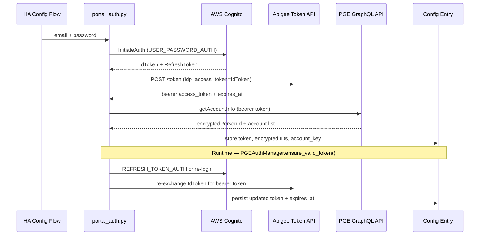

# Portland General Electric Energy Usage for Home Assistant

Custom Home Assistant integration that imports **Portland General Electric (PGE)** energy usage into the Energy Dashboard via PGE’s GraphQL API (not Opower, not HTML scraping).

> **Not Pacific Gas & Electric (PG&E).** This integration is for [Portland General Electric](https://portlandgeneral.com/) in Oregon. It does **not** work with California PG&E / Opower integrations.

**Requires Home Assistant 2026.7.0+.**

> **Unsupported / unofficial:** MFA- and CAPTCHA-enabled PGE accounts are not supported (fail closed). The customer portal API is unofficial and may change without notice. Not endorsed by or affiliated with Portland General Electric.

## Installation

### HACS (recommended)

1. In HACS → **⋯** → **Custom repositories**, add  
   `https://github.com/spencerthayer/homeassistant-pge`  
   with category **Integration**.
2. Search for and install **Portland General Electric Energy Usage** (version matches the latest GitHub Release, e.g. `0.6.0`).
3. Restart Home Assistant.

### Manual

1. Copy `custom_components/pge_energy` into `config/custom_components/`.
2. Restart Home Assistant.

## Setup

1. Settings → Devices & Services → Add Integration → “Portland General Electric Energy Usage”.
2. Enter PGE **email**, **password**, and **account number** (one entry per account).
3. The same login can be reused for additional entries with different account numbers; separate logins each need their own entry.
4. **MFA-enabled PGE accounts are not supported.** If PGE requires MFA or CAPTCHA, setup fails closed.

## Architecture

### Authentication & API data model



The integration authenticates through a **Cognito → Apigee → GraphQL** chain. Email/password are exchanged for a Cognito `IdToken`, which is then traded for an Apigee bearer token (short-lived). This bearer token authorizes all subsequent GraphQL calls (`getUsageCompare`, `getAccountDetailList`, `getEnergyTrackerData`, etc.). The `PGEAuthManager` wraps the token with proactive expiry checks and automatic renewal — on 401 mid-sync it calls `force_renew()` and retries once. After every renewal the fresh token is persisted back to the config entry (without triggering a reload).

### Sensor data model

```mermaid
flowchart LR
    subgraph API[PGE GraphQL API]
        direction TB
        GQ1[getUsageCompare<br/>HOURLY / DAILY / MONTHLY]
        GQ2[getAccountDetailList<br/>+ paymentHistory]
        GQ3[getEnergyTrackerData]
        GQ4[getProgramsEnrollmentStatus]
    end

    subgraph CLIENTS[API Clients]
        UA[PGEApiClient] -->|"UsageResponse, UsageInterval list"| Coord
        BA[PGEBillingApiClient] -->|AccountSnapshot| Coord
        BA -->|"LedgerEvent list"| Coord
        BA -->|EnergyTrackerEstimates| Coord
        BA -->|ProgramsSnapshot| Coord
    end

    subgraph COORD[PGECoordinator]
        Coord{lifetime_energy_kwh<br/>lifetime_cost_usd<br/>recent_intervals<br/>freshness}
    end

    subgraph STATS[Statistics Module]
        IMP[async_import_with_baseline]
        IMP -->|consumption| EXTC[(pge_energy:&lt;key&gt;_consumption<br/>sum, kWh)]
        IMP -->|cost| EXTCST[(pge_energy:&lt;key&gt;_cost<br/>sum, USD)]
        IMP -->|temperature| EXTT[(pge_energy:&lt;key&gt;_temperature<br/>mean, °F)]
        IMP -->|mirror| MIR[(sensor.pge_*<br/>entity statistics)]
    end

    subgraph SENSORS[Sensors]
        E[Energy / Cost /<br/>Outdoor Temperature] -->|total_increasing / total / measurement| HA
        H[Hourly Energy / Cost] -->|measurement tip| HA
        D[Current Day / Yesterday<br/>Energy & Cost] -->|total| HA
        B[Account Balance / Amount Due<br/>Due Date / Last Payment] --> HA
        L[Lifetime Payments / Billed] -->|total| HA
        T[Billing Cycle Day /<br/>Estimated Charges] --> HA
        P[Program Binary Sensors<br/>Autopay, Paperless, PTR,<br/>Green Future, TOD, etc.] -->|is_on| HA
        S[Sync Status / Progress<br/>Data Age / Latest Interval] -->|diagnostic| HA
    end

    GQ1 --> UA
    GQ2 --> BA
    GQ3 --> BA
    GQ4 --> BA

    Coord -.->|accounts / sync/subscribe WS| PANEL[PGE Panel /pge]
    PANEL -.->|recorder/statistics_during_period| STATS

    Coord -->|import via| STATS
    Coord -->|read properties| SENSORS
```



All API clients share a single `PGEAuthManager` and `aiohttp.ClientSession`. Usage data (`PGEApiClient`) and billing/programs data (`PGEBillingApiClient`) hit the same GraphQL endpoint at `https://apix.portlandgeneral.com/pge-graphql` with different origin headers (`widget.portlandgeneral.com` vs `portlandgeneral.com`). The coordinator feeds the statistics module (dual-publish: external + entity-mirrored) and serves as the property source for all sensor entities. The `/pge` panel reads chart series directly from the HA recorder via `statistics_during_period`.

### Authentication status

- Email/password login (Cognito → Apigee) with automatic token renewal; no MFA/CAPTCHA support (fail closed).
- Account number selects which PGE account the entry binds to (matched against login discovery); entry title is `PGE <accountnum>`.
- Setup validates connectivity with a **HOURLY yesterday** request (not a short DAILY window — those hard-error on the live API).
- Reauth and **Update credentials** use email/password only (account number stays fixed). Passwords are stored in the Home Assistant config entry when needed as a renewal fallback.

### Configure (options)

Settings → Devices & Services → PGE Energy → **Configure** (opened from any account entry):

- **Sync settings:** polling (value + unit `minutes` / `hours` / `days`, default **every 4 hours**), **sync clock** (Pacific, default **12:00 AM** — anchors the hour/day grid), correction window, history mode/start, hourly history days, auto backfill, cost/diagnostics, **import billing & programs** (`include_billing`, default on), concurrency. Per account.
- **Panel:** integration-wide chrome for `/pge` (stored once for the whole domain, not per account): **Show PGE in sidebar** (default on), **Sidebar title** (default `PGE`), **Sidebar icon** (default `mdi:transmission-tower`), **Admin-only panel** (default on), **Default landing section** (At a glance / Usage / Analytics / Billing). Hiding the sidebar link does **not** unregister `/pge` — open that URL directly. **Admin-only panel** off lets non-admins open the route, but account/sync websocket APIs stay admin-only. Sidebar *order* remains Home Assistant’s sidebar editor or [Browser Mod](https://github.com/thomasloven/hass-browser_mod).
- **Update credentials:** email/password; account number is read-only; statistic IDs unchanged.
- **Manual sync:** force **Refresh now** (correction window) or **Backfill missing history** (uses current Sync settings history bounds). Remains available when the sidebar link is hidden. A notification links to the PGE device page; live **Sync status** / **Sync progress** (%) sensors show phase, ETA, and detail.
- Details: [`docs/HA_SETTINGS_HISTORY.md`](docs/HA_SETTINGS_HISTORY.md).

## Sensors and statistics

Every usage series is available in **both** forms:

| Use case | Pick |
|----------|------|
| Entity picker, History, most Lovelace cards | `sensor.pge_<account>_energy` / `_cost` / `_outdoor_temperature` |
| Energy dashboard / statistics graphs | `pge_energy:<account_key>_consumption` / `_cost` / `_temperature` |

Long-term hourly history is written to external statistics **and** mirrored onto the Energy / Cost / Outdoor temperature entity statistic IDs, so those sensors are fully graphable (Statistics graph on the entity, not only the latest state).

| Sensor | Description |
|--------|-------------|
| Energy | Lifetime cumulative kWh (entity + mirrored history) |
| Cost | Lifetime cumulative USD (entity + mirrored history) |
| Outdoor temperature | Latest °F; full history mirrored onto the entity |
| Hourly energy / Hourly cost | Latest interval point values |
| Current day energy / cost | Pacific local today totals |
| Yesterday energy / cost | Pacific local yesterday totals |
| Last successful update | Last successful API poll |
| Latest available interval | Newest PGE interval end |
| Data age | Seconds since last success |
| Authentication expiration | Token expiry (disabled by default) |
| Last API error | Last API error (disabled by default) |

### Billing & programs (when `include_billing` is on)

Same device (`PGE <accountnum>`). Structured fields only — bill PDF download is deferred (see [`docs/HA_SETTINGS_HISTORY.md`](docs/HA_SETTINGS_HISTORY.md)).

| Sensor / binary | Description | Dual stats |
|-----------------|-------------|------------|
| Account balance / Amount due | Current balance banner | `_account_balance` / `_amount_due` (mean) |
| Due date / Last payment date | Timestamps | — |
| Last payment amount | Most recent payment | `_last_payment_amount` (mean) |
| Current bill amount / kWh / period | Latest bill details | mirrors latest of `_bill_amount` / `_bill_kwh` |
| Previous balance / Current charges | Bill line items | — |
| Bill period avg temperature | °F from view-bill | `_bill_avg_temperature` (mean) |
| YTD program savings | Flex-load earnings | `_ytd_program_savings` (mean) |
| Lifetime payments / Lifetime billed | Sums from imported ledger | `_payment_amount` / `_bill_amount` (sum) |
| Estimated current charges / next bill (low, high) | PGE's own open-cycle projection from the portal Current Use card | — |
| Billing cycle day / length | Position in the open cycle (e.g. day 17 of 30) | — |
| Billing last sync | Billing watermark | diagnostic |
| Auto Pay / Paperless bill | Binary enrollment | — |
| Peak Time Rebates / Green Future / Time of Day / Smart Thermostat / Habitat Support | Program binary sensors | Green Future exposes `green_future_pct` |

Energy / Cost / Outdoor temperature (and dual-publish billing sensors) expose `external_statistic_id` and `entity_statistic_id` attributes for automations and custom cards.

The estimate sensors come straight from PGE (`getEnergyTrackerData`) and are its own projection for the open cycle — they will not tie out against sums of the imported hourly intervals, and they stay unavailable until PGE reports `detailsAvailable`.

## Energy Dashboard

1. Settings → Dashboards → Energy.
2. Add electricity consumption.
3. Select either `pge_energy:…_consumption` or the `sensor.pge_…_energy` statistic (and cost if desired).

## PGE Energy panel (`/pge`)

The integration registers [`/pge`](http://127.0.0.1:8123/pge) for usage, cost, outdoor temperature, billing, programs, and live sync progress across all config entries. By default it also adds a sidebar item **PGE** (admin users). Configure → **Panel** can hide that link, rename/re-icon it, change the admin gate, or pick a default landing section — `/pge` stays reachable either way. Sidebar *order* is still controlled through Home Assistant’s sidebar editor or [Browser Mod](https://github.com/thomasloven/hass-browser_mod); this integration does not rewrite those user-store settings.

> **Recovery (0.5.41–0.5.45):** those versions could write synced Home Assistant sidebar user settings that override Browser Mod. After upgrading to **0.5.46+**, use Browser Mod’s **Clear** control for synced sidebar settings once (or reset order/hide in Home Assistant’s sidebar editor), reapply the desired Browser Mod preferences, then restart Home Assistant and hard-refresh if needed.

- Static assets: `/pge_energy_frontend/` (panel JS + vendored [Apache ECharts](https://echarts.apache.org/examples/en/index.html)) and `/pge_energy_brand/` (bundled logo).
- Data: `pge_energy/accounts` + `pge_energy/sync/subscribe` (admin websocket); chart series via built-in `recorder/statistics_during_period`.
- At a glance includes Yesterday and Week (Pacific Sunday → yesterday) kWh/cost from imported intervals, plus statement / since-statement / PGE estimate cards.
- Usage chart includes **Range accounting** for the selected window: totals, per-hour/day/month/year averages, $/kWh, median/min/max/stdev, and adaptive Pacific hour/day/month/year breakdown tables (scales from short windows through multi-decade history). Range accounting and breakdown accordions remember open/closed in the browser; **Billing** is always expanded (not an accordion).
- Usage ranges end at Pacific midnight of the current day (exclusive): only complete published data through **yesterday**. Primary fast-select: **24h**, **This cycle**, **Last cycle**, **7 days**, **Month**; **More…** covers `6h` / `12h` / `3mo` / `6mo` / `12mo` / YTD (unavailable options stay visible but disabled). Default `24h`; ◀/▶ and datetime inputs scroll or pick a window. A collapsible **Sync status** section under At a glance (default collapsed; open/closed remembered in the browser) holds live import progress above **PGE publication gaps**.
- Layout adapts for phone and tablet: summary metrics stack to one column under 640px, cost/heatmap grids stack under 900px, filter controls and charts scale for narrow viewports, and breakdown tables scroll horizontally.
- Note: `/energy/pge` cannot be a distinct page — HA routes panels by the first URL segment, and `energy` is the built-in Energy panel.

## Services

All long-running services require `entry_id`:

- `pge_energy.refresh` — optional `entry_id`
- `pge_energy.backfill` — `entry_id`, `start_date`, `end_date` (tiered hourly → daily → monthly)
- `pge_energy.retry_failed_ranges` — `entry_id`
- `pge_energy.reset_import_checkpoint` — `entry_id` (does not delete recorder history)

## Known limitations

- MFA / CAPTCHA accounts unsupported by design.
- Hourly day responses include a +1 boundary hour at `day_end`; the integration clips to `[day_start, day_end)`.
- Full history uses daily/monthly when hourly retention ends (~1 year).
- DAILY windows under ~31 days may hard-error (`Something unexpected happened`); prefer HOURLY or ≥31d DAILY.
- MONTHLY returns the latest ~12 billing periods per call; older history requires paging backwards.
- Response `totalKwhUsage` / `totalKwhCost` are reliable mainly for DAILY.
- **PGE publishes usage once overnight, not continuously.** Hourly intervals for a Pacific calendar day typically appear after midnight (often with the tip stuck near `01:00` local until the next publication). A “stuck” Latest available interval during the day is expected — not a sync failure. Default polling is **every 4 hours** on a Pacific clock grid (**Sync clock**, default **12:00 AM** → 12am/4am/8am/noon/4pm/8pm); Configure → Sync settings can tighten or loosen that.
- PGE may return transient 502s (retried). See [`DATA_CONTRACT.md`](DATA_CONTRACT.md).

## Local CLI testing

The packaged CLI reuses production `api` / `auth` / `portal_auth` modules (no running Home Assistant required beyond the test venv for package imports). Prefer an opt-in `.env` (gitignored; `chmod 600`; never auto-loaded). See [`docs/LIVE_TESTING.md`](docs/LIVE_TESTING.md) for commands, fixture sanitization, and UI UAT notes.

## Development

```bash
python3 -m venv .venv
.venv/bin/pip install -r requirements_test.txt
bash scripts/run_tests.sh
```

## Security

See [`SECURITY.md`](SECURITY.md). Diagnostics redact tokens, passwords, emails, person IDs, and account numbers.

## Removal

Settings → Devices & Services → PGE Energy → Delete. Optionally remove `custom_components/pge_energy`.
To revoke portal access, change the PGE password and remove the integration.
