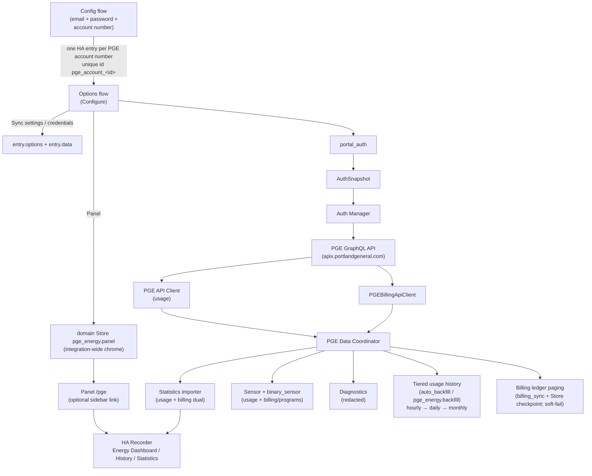

# PGE Energy Integration Architecture

## Component Diagram

## Trust Boundaries

1. **PGE Portal** (external): Login + GraphQL. MFA/CAPTCHA unsupported.
2. **Home Assistant** (trusted): Config entry storage, Store for backfill state, recorder.
3. **Immutable `account_key`**: Survives person-ID/token rotation; never derived from renewable secrets after first persist.
4. **Local CLI / UAT**: Optional `.env` + packaged CLI (`docs/LIVE_TESTING.md`); HA owner login is separate from PGE portal credentials.

## Runtime Flows

### Authentication (production)

1. Setup collects **email + password + account number** (required). Same login may create multiple entries with different account numbers; separate logins each get their own entry.
2. `portal_auth` login (Cognito `USER_PASSWORD_AUTH` → Apigee bearer → `getAccountInfo`); match the entered account number to discovered accounts (exact or digits-only).
3. Validate with HOURLY yesterday `GetUsageCompare`; persist email, renewal secret (or password fallback), account id, person id, immutable `account_key`. Best-effort AccountDetail discovery also persists encrypted account / premise / SA ids for programs and ledger. Entry unique id is account-scoped (`pge_account_<id>`). Title/device name: `PGE <accountnum>`.
4. Keep access token in memory; renew under async lock before GraphQL calls (skew before expiry; forced 401 renew+retry on credential mode). Tokens are short-lived — password/refresh re-login may run nearly every sync.
5. Cognito `TooManyRequests` / “Password attempts exceeded” → `PGERateLimitError` with a shared per-email cooldown (no further InitiateAuth while cooling down; no password→refresh amplify; soft-fail retains sensors without reauth UI). Concurrent `force_renew` waiters coalesce onto one login. See [`AUTH_DISCOVERY.md`](AUTH_DISCOVERY.md).
6. MFA/CAPTCHA → fail closed. Manual bearer-token paste is removed (legacy `auth_mode=manual_token` entries may still load until reauth upgrades them).
7. Options → **Update credentials** re-runs login; account number / `account_key` / statistic IDs stay fixed. Reauth is email/password only.

### Options / Configure

Settings → Devices & services → PGE Energy → **Configure** (from any account entry):

1. **Sync settings** — stored in `entry.options` (per account).
2. **Panel** — integration-wide presentation for `/pge`, persisted in domain Store `pge_energy.panel` (not `entry.options`). Fields: `show_sidebar`, `sidebar_title`, `sidebar_icon`, `require_admin`, `default_section`. Save validates → writes Store → serialized remove/register of the panel (`async_apply_panel`); aborts the OptionsFlow without `async_create_entry` so account options, reload, and in-flight sync are untouched. Apply failure rolls back Store + registration when possible. Hiding the sidebar omits chrome (`sidebar_title=None`) but keeps the `/pge` route. Never mutates frontend user-store `sidebar` / `panelOrder` / `hiddenPanels`. Websocket `pge_energy/*` APIs stay `@require_admin` even when `require_admin` is false on the panel.
3. **Update credentials** — updates `entry.data` and reloads the entry.
4. **Manual sync** — starts a background refresh or history backfill (Sync settings bounds); progress on coordinator `SyncProgressSnapshot` + device diagnostic sensors; persistent notification deep-links to the device page (does not reload the entry). Remains available when the sidebar link is hidden.

Polling is `polling_interval` + `polling_interval_unit` (`minutes`|`hours`|`days`) plus `sync_local_time` (`HH:MM:SS`, default **00:00:00** America/Los_Angeles). Default cadence is **every 4 hours** on that clock grid (00:00 / 04:00 / 08:00 / 12:00 / 16:00 / 20:00). Hour and day units align to `sync_local_time`; minute units use a fixed interval (min 15). Legacy options with only a numeric interval (no unit) are treated as minutes.

### Routine Polling

1. Coordinator delay from options (default next configured Pacific sync time; otherwise fixed minutes/hours).
2. `ensure_valid_token()` / renewal-aware fetch.
3. Fetch **correction window** as one PGE-local day per hourly request (re-fetch closed days for estimated→actual / cost corrections). Imports are merge/upsert only — never purge already-downloaded history.
4. Clip hourly rows to `[day_start, day_end)`; validate closed days (including `complete_with_gap` for explicit null-kWh hours); split signed HOURLY rows into non-negative `_consumption` / `_return` / `_cost` / `_compensation` via `usage_direction.split_signed_usage`; suffix-rebuild import under per-entry lock; persist `dirty_from` around writes. Coarse DAILY/MONTHLY rows never invent return/compensation.
5. After each external write, `async_ack_external_statistics` drains the recorder queue and verifies exact `state` values. On mismatch it **re-issues** `async_add_external_statistics` (bounded write attempts) before failing — re-reading alone cannot converge when HA's `import_statistics` dropped the job (SQLAlchemy errors inside `_update_statistics` are swallowed). Persistent mismatch means a dropped write / unhealthy recorder DB, not a benign overwrite (`_update_statistics` always writes `state`/`sum`). Consumption ack failure soft-fails the poll and leaves `dirty_from` for boot repair; cost/return/compensation/temperature ack failures mark the affected Pacific days failed, keep external + entity mirrors in step, and still clear `dirty_from`. Boot runs a one-time signed-usage migration that moves fine-grained negative consumption/cost states into `_return` / `_compensation`.
6. When `include_billing` (default on): `billing_sync` runs AccountDetail snapshot → paged payment history → open-cycle estimates → programs → optional bill PDF phase when `download_bill_pdfs` is also on (`bill_pdf_sync`: REST download, local parse, 18 `_bill_pdf_*` statistics, binary retention GC). Dual-publishes billing statistics; soft-fails into `billing_last_error` without failing the usage poll. PDF failures use separate `bill_pdf_last_*` summaries. Manual sync phases include `billing_snapshot` / `billing_history` / `programs` / `downloading_pdfs` / `parsing_pdfs` / `importing_pdf_statistics`.
7. Recompute the next poll delay after each cycle so day-unit schedules stay on the configured Pacific clock.

### Auth / sync failure retention

Auth blips and partial poll failures must **not** blank the panel or erase recorder history:

- Soft-fail returns the previous coordinator payload when retained state exists (tip intervals, lifetime totals, billing snapshot, or import-store checkpoints).
- Token renew DNS/TLS blips (`PGEConnectionError` during Cognito/Apigee login) soft-fail the same way — they must not raise `UpdateFailed` and blank cold-start sensors.
- Tip intervals are only replaced when the poll returns new intervals — an empty/failed correction window keeps the prior tip.
- Entities stay `available` while retained state exists (`PGEBaseEntity.available`), so At a glance / billing keep last-known values.
- Transient credential auth failure requests a single reauth flow; it does not unload the entry or clear statistics. Cognito / GraphQL **rate limits** soft-fail without reauth. Hard `ConfigEntryAuthFailed` only when there is nothing retained yet (first setup) or MFA is permanently unsupported.

### Tiered history / backfill

1. History start from options: `full` → floor `2019-01-01`, or `start_date`.
2. End = yesterday (closed local days, `America/Los_Angeles`).
3. **Hourly** for newest `hourly_backfill_days`; **daily** for older incomplete days (month windows, padded ≥31d for API); **monthly** via paged `get_monthly_usage_paged` for remaining gaps.
4. MONTHLY stats write a billing-period total onto calendar month-start **only when that month has no finer completed days**. Otherwise gap days are closed without importing the lump (avoids double-count with hourly). Startup repair zeros any leftover monthly lump that shares a Pacific day with smaller rows.
5. Scheduled poll (default every 4 hours from midnight Pacific) re-fetches the correction window. If yesterday’s hourly is still incomplete, import any hours returned, demote the day from `completed`, and catch up every 2 hours until it validates. While a backfill is in progress, the poll returns the retained payload and does **not** contend for `import_lock`.
6. Auto-backfill on setup/reload when `auto_backfill` and history is incomplete.
7. Service `pge_energy.backfill` uses the same tiering; reject overlapping jobs; persist completed/failed local dates; resume after restart (targets kept on unload cancel; cleared on stall abort / hard failure).
8. **Hang recovery:** long-lived jobs use `hass.async_create_background_task` (never `hass.async_block_till_done` from import paths — that deadlocks when a tracked backfill waits on `import_lock` held by a poll). Progress heartbeat + stall watchdog (default 30m), hard-release after cancel grace, generation-guarded state so orphans cannot clobber a newer job, per-tier `asyncio.wait_for` (2h), and bounded `.storage` saves (30s; critical vs non-critical). Boot rewrites a restored `backfilling` status to `failed` until a real resume task starts.

Implemented in `backfill.py` + helpers in `options.py`; wired from `__init__.py`.

## Local UAT lifecycle

| Script    | Role                                                                                                                           |
| --------- | ------------------------------------------------------------------------------------------------------------------------------ |
| `./scripts/start.sh` | Resume latest `outputs/ha_live/20*` (or `current`); refresh `pge_energy` symlink; daemonize `.venv/bin/hass`; wait for `:8123` |
| `./scripts/stop.sh`  | SIGTERM/SIGKILL live hass; clear pid; confirm port closed                                                                      |

Bare `homeassistant.restart` from the UI **exits** this process (no Supervisor) — use `./scripts/stop.sh` && `./scripts/start.sh` to reload custom component code.

## Key Modules

| Module | Role |
| ------ | ---- |
| `portal_auth.py` | Email/password login/refresh (Cognito + Apigee) |
| `auth.py` | Auth manager, snapshots, immutable account key + encrypted billing ids |
| `api.py` | GraphQL client + monthly paging + error classification |
| `billing_api.py` / `billing_models.py` | AccountDetail, nested paymentHistory, energy-tracker estimates, programs GraphQL |
| `billing_sync.py` / `billing_statistics.py` | Soft-fail billing orchestration + dual-publish stats |
| `bill_pdf*.py` | Opt-in PDF REST download, parser, Store index, statistics, sync phase |
| `coordinator.py` | Polling from options, correction window, import lock, billing hook |
| `options.py` | Option helpers, history bounds, tier date ranges, polling conversion |
| `backfill.py` | Tiered hourly→daily→monthly history import |
| `statistics.py` | External stats (`pge_energy:…`) + mirror onto sensor entity stats (`sensor.pge_…`) |
| `sensor.py` | Usage + billing sensors (dual-publish where graphable) |
| `binary_sensor.py` | Auto Pay / paperless / program enrollment |
| `store.py` | Versioned per-entry import state (+ billing ledger checkpoint) |
| `config_flow.py` | Credential setup (email/password/account number), reauth, OptionsFlow |
| `day_validation.py` | Hourly local-day clip/validate (boundary hour) |
| `cli.py` | Offline login/renew/validate/fetch + billing-snapshot/history/programs |
| `panel_settings.py` | Domain Store `pge_energy.panel` for integration-wide panel chrome (load/save/normalize/validate) |
| `panel.py` | Static paths once + locked setup/apply/teardown for `/pge` from Store settings; optional sidebar chrome; passes `config.default_section` to the frontend; never reads/writes user-store `sidebar` (`panelOrder` / `hiddenPanels`) |
| `websocket.py` | Admin WS: `pge_energy/accounts`, `pge_energy/sync/subscribe` (credential-free) |
| `frontend/pge-panel.js` + `theme.js` | Buildless ES-module custom panel (Apache ECharts); honors `panel.config.default_section` with a one-shot post-render scroll (`glance`/`usage`/`analytics`/`billing`); Usage hero is one combined kWh/cost/°F chart; primary range buttons `24h` / This cycle / Last cycle / 7 days / Month plus a More… dropdown (`6h`/`12h`/`3mo`/`6mo`/`12mo`/YTD); unavailable presets stay visible but disabled; bill-bound ranges use statement dates (last cycle = equal length before current start); Usage Range accounting / rollup `
` remember open/closed via `localStorage`; Billing is always expanded (no accordion); shift/custom range controls and a PGE publication-gaps card; ranges end at Pacific midnight (exclusive). Insight charts trim empty ranges (heatmap first→last populated day, monthly $/kWh, dual billed/payments bars, padded scatter). Colors resolve from HA theme tokens (`theme.js`) so light/dark/custom themes stay readable; charts rebuild on theme change |

Mean billing series (account balance / amount due / last payment / bill period avg temperature / YTD savings) are **external-only** (`pge_energy:…`) and never mirrored onto recorder entity statistics: a snapshot-stamped row pre-seeds the current-hour slot, and HA Core's `compile_statistics` plain INSERT then fails with `UNIQUE constraint failed: statistics.metadata_id, statistics.start_ts` ("Blocked attempt to insert duplicated statistic rows"). Sum series (`_bill_amount`, `_payment_amount`) still mirror onto `sensor.pge_*_lifetime_billed` / `_lifetime_payments`, and usage energy/cost/outdoor-temperature history mirrors onto its entity ids. All remaining entity mirrors funnel through `_async_mirror_entity_statistics`, which caps mirrored rows at `utcnow` floored − 2h (current + last two closed hours) so a mirror can never pre-seed a slot before HA Core's `compile_statistics` finalizes it; the excluded newest hours are compiled natively and re-curated by the mirror on a later cycle.

## Related docs

- [`HA_SETTINGS_HISTORY.md`](HA_SETTINGS_HISTORY.md) — Configure options, manual sync, deferred bill PDFs
- [`LIVE_TESTING.md`](LIVE_TESTING.md) — CLI probes and maintainer UAT
- [`DATA_CONTRACT.md`](DATA_CONTRACT.md) — GraphQL shapes and retention
- [`../SECURITY.md`](../SECURITY.md) — Credential storage and redaction
- Auth: Cognito + Apigee hybrid email/password in `portal_auth.py` (MFA/CAPTCHA fail closed)
